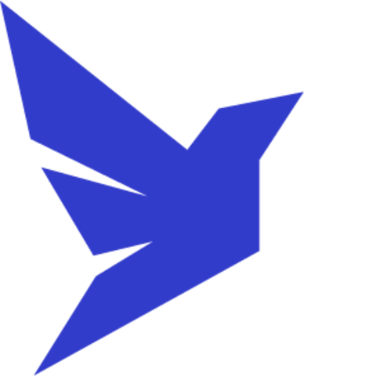

# Hi there, I'm Daniel 👋

- 📚 I'm a UI/UX Designer, Front-end Developer and ML Developer!!
- 🌱 I’m currently learning everything 🤣
- ⚡ Fun fact: I love to draw and play eletric guitar

### Connect with me:

  <a href="https://www.linkedin.com/in/dansousamelo/" />
  <a href="mailto:daniel_sousa.unb@outlook.com/" /> 

  

 
 

### Languages and Tools:

 
 

---
# My GitHub Stats

